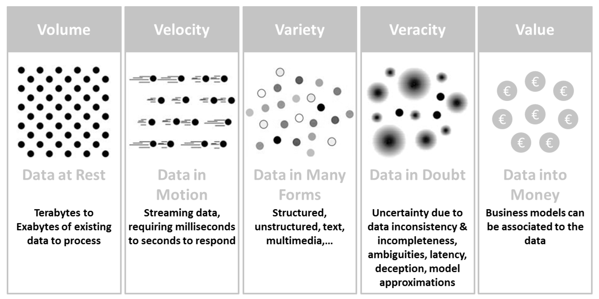
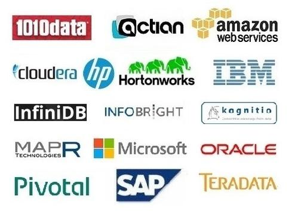

# I. Introducción al Big Data.

## ¿Qué es el Big Data y por qué existe?

> Big Data puede definirse como el conjunto de **nuevas tecnologías y arquitecturas** diseñadas para la obtención de valor de grandes volúmenes y variedad de datos de una forma rápida, facilitando su captura, procesamiento y análisis.

## Propiedades del Big Data (5v's).

    

- **Volumen**: Es quizás la característica más asociada al concepto de Big Data. Son Terabytes, Exabytes de datos a procesar.
- **Velocidad**: De la misma manera, todos estos datos son generados de manera continua e instantánea. Esto supone que los datos tengan ciclos de vida cortos, haciendo obsoletos los datos que instantes antes eran válidos.
- **Variedad**: Estas enormes cantidades de datos son diversos en cuanto a tipología y fuentes de obtención. Esta diversidad es clave para la riqueza de posibilidades del Big Data. Pero a la vez aumenta el grado complejidad tanto en su almacenamiento como en su procesamiento y análisis.
- **Veracidad**: La veracidad puede entenderse como el grado de confianza que se establece sobre los datos a utilizar, esta coponente determinará la calidad de los resultados y la confianza en los mismos.
- **Valor**: Fin último del an análisis de datos Big Data. Supone el conocimiento e información útil que se puede extraer de estos.

## ¿Por qué se necesita Big Data?

Algunos datos...

- 90% de los datos existentes en el mundo fueron creados durante los últimos dos años.
- 80% de los datos existentes en el mundo son "no estructurados".
- Mucha de la información tiene un periodo de vida útil muy corto.
- Los datos potencialmente valiosos están inactivos o descartados.

## Casos de uso y su impacto en los negocios.

### Big Data en el mundo empresarial

La introducción del Big Data en el ecosistema empresarial implica una serie de retos y preguntas que deben tomarse en cuenta:

- ¿Cuáles son las fuentes de datos importantes para la empresa y cuál es la manera más eficiente de recopilarlos?
- ¿Qué tan intensivamente deberían ser recopilados esos datos?
- ¿Cómo se mantiene la calidad de los datos a través de tantas fuentes de información, muchas de las cuales son exteriores a la organización, como las redes sociales?
- ¿Cómo se pueden estructurar los datos provenientes de fuentes no tradicionales (como documentos y videos) para facilitar su almacenamiento, análisis y la toma de decisiones?
- ¿De qué manera se pueden integrar datos no estructurados con datos almacenados en sistemas tradicionales?
- ¿Cuáles son los niveles de disponibilidad y confiabilidad que se pueden alcanzar siendo el volumen de los datos tan grande?
- Debido al nivel de especialización necesario para el procesamiento de datos, el cloud computing es la plataforma adecuada?
- En términos de seguridad y privacidad, ¿cómo se puede reducir la vulnerabilidad al diseñar un entorno de Big Data?

### Casos de uso

Para comprender mejor de qué modo las empresas han usado el análisis de datos y cuáles son algunas de sus aplicaciones, veamos algunos casos de éxito en el uso de Big Data con cinco empresas que han sido pioneras en este campo:

- **Amazon:** El 35% de sus ventas anuales provienen de la recomendaciones de productos. Cada vez que alguien entra a Amazon, se recopila información acerca de qué buscan, qué compran, qué artículos ponen en el carrito de compras e incluso cuánto tiempo pasan mirando un artículo; de este modo, cuando un usuario similar entra a Amazon, el sistema ya sabe qué podría gustarte y te ofrece productos basándose en todos esos datos recopilados.

- **Netflix**: Gran parte del éxito de esta plataforma de streaming se debe a que utilizan la información que sus más de **65 millones de miembros** a lo largo del mundo les brindan para conocer sus hábitos. Es por eso que la tasa de **retención de usuarios es tan alta (93%)**. Los datos de las más de diez horas de series y películas vistas al día son almacenados y monitoreados para comprender los gustos y hábitos de los usuarios. De este modo, Netflix sabe qué tipo de contenido les gustarán basados en su historial. Su algoritmo para hacerte recomendaciones, que no habría podido ser creado sin el análisis de Big Data y el machine learning, es uno de los más envidiados, ya que el 85% del consumo en Netflix es generado a través de él.

- **Tesla**: Cada automóvil que ha vendido esta compañía cuenta con sensores internos y externos que se encargan de recopilar todo tipo de información (del conductor, del auto y de la ruta). Estamos hablando de más de 100 millones de millas de información que permitirán que un día, uniendo el análisis de Big Data con machine learning e inteligencia artificial, todos los Tesla se vuelvan vehículos autónomos.

## Teconologías asociadas.

- **Análisis de flujo**: software que puede filtrar, agregar, enriquecer y analizar un alto rendimiento de datos de múltiples fuentes de datos en vivo y en cualquier formato de datos.

- **Fábrica de datos en memoria**: proporciona acceso de baja latencia y procesamiento de grandes cantidades de datos mediante la distribución de datos a través de la memoria de acceso aleatorio dinámica (DRAM), Flash o SSD de un sistema informático distribuido.

- **Almacenes de archivos distribuidos**: una red informática donde los datos se almacenan en más de un nodo, a menudo de forma replicada, para redundancia y rendimiento.

- **Virtualización de datos**: una tecnología que ofrece información de varias fuentes de datos, incluidas fuentes de Big Data como Hadoop y tiendas de datos distribuidos en tiempo real y casi en tiempo real.

- **Integración de datos**: herramientas para la orquestación de datos.

- **Preparación de datos**: software que alivia la carga de aprovisionar, dar forma, limpiar y compartir conjuntos de datos diversos y desordenados para acelerar la utilidad de los datos para el análisis.

- **Calidad de los datos**: productos que realizan limpieza y enriquecimiento de datos en grandes conjuntos de datos de alta velocidad, utilizando operaciones paralelas en almacenes de datos distribuidos y bases de datos.

## Principales vendors y soluciones en el mercado.

    

