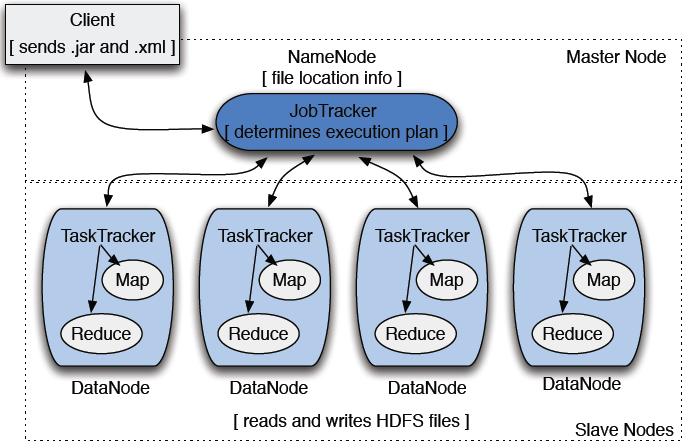
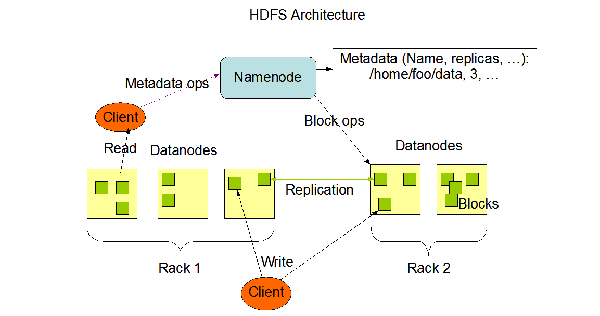
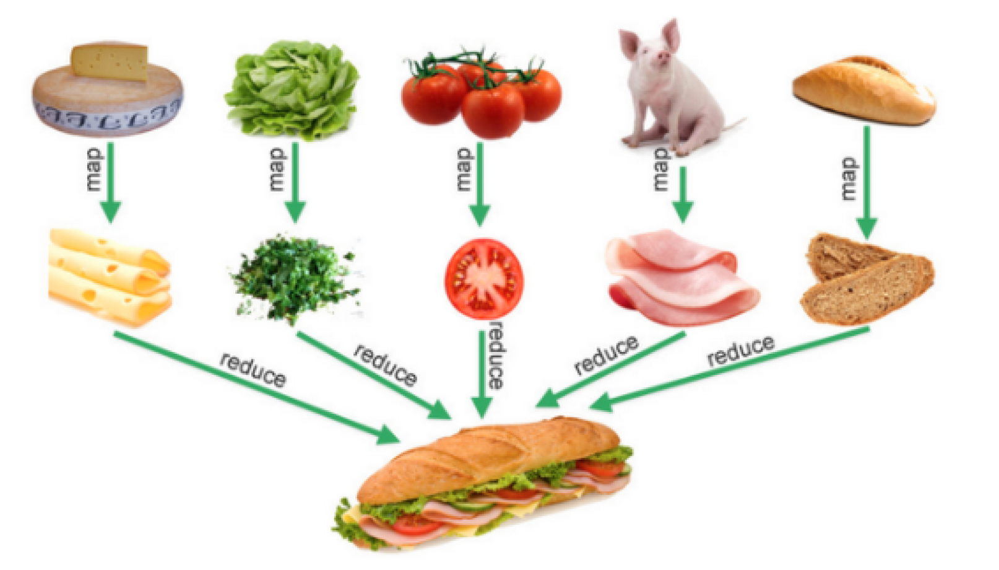
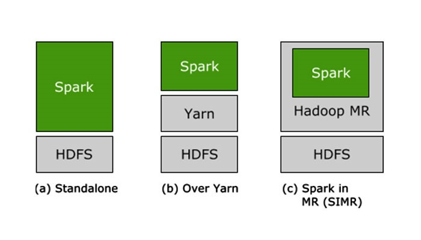

### II. Ecosistema Hadoop/Spark.

## ¿Qué es Hadoop? Aclarando conceptos fundamentales.

## Breve historia.

A medida que la World Wide Web creció a principios de este siglo, los motores de búsqueda y los índices fueron creados para ayudar a localizar información relevante.

A medida que la web fue creciendo, se fue necesitando automatización. Entonces se crearon rastreadores web, algunos como proyectos de investigación dirigidos por algunas universidades y arrancaron los motores de búsqueda como: Yahoo, AltaVista, etc.

Uno de esos proyectos fue un motor de búsqueda web de código abierto llamado **Nutch**, creación de
**Doug Cutting y Mike Cafarella**.

    

Ellos pretendían devolver resultados de búsqueda web más rápido distribuyendo datos y cálculos entre diferentes computadoras para que se pudieran realizar múltiples tareas simultáneamente. Durante este tiempo, otro proyecto de motor de búsqueda llamado Google estaba en progreso. Se basaba en el mismo concepto: almacenar y procesar datos de forma distribuida y automatizada para que los resultados de búsqueda web relevantes pudieran devolverse más rápidamente.

Para el año 2006, Cutting decidió unirse a Yahoo y se llevó consigo el proyecto Nutch, así como ideas basadas en los primeros trabajos de Google con la automatización del almacenamiento y procesamiento de datos distribuidos.

El proyecto de Nutch se dividió: la parte del rastreador web permaneció como Nutch y la porción de procesamiento y computación distribuida se convirtió en **Hadoop** (que lleva el nombre del elefante de juguete del hijo de Cutting).

## ¿Qué lo hace especial?

- **Capacidad para almacenar y procesar cantidades grandes de cualquier tipo de datos, y además de forma rápida:** Con volúmenes y variedades de datos en constante aumento, especialmente desde las redes sociales y el Internet de las cosas (IoT), esa es una consideración clave.

- **Cuenta con poder computacional:** El modelo de computación distribuida de Hadoop es capaz de procesar grandes
  cantidades de datos rápidamente. Cuantos más nodos de computación use, más poder de procesamiento tendrá.

- **Tolerante a fallos:** El procesamiento de aplicaciones y datos está protegido contra fallas del hardware. Si un nodo se cae, los trabajos se redirigen de forma automática a otros nodos para asegurarse de que la informática distribuida no falle. Varias copias de todos los datos se almacenan automáticamente.

- **Es muy Flexible**: A diferencia de las bases de datos tradicionales, no es necesario procesar previamente los datos antes de almacenarlos. Puede almacenar tantos datos como usted guste y decidir cómo usarlos más adelante. Eso incluye datos no estructurados como imágenes, textos o vídeos.

- **Es de bajo costo:** El marco de código abierto es totalmente gratuito y utiliza hardware básico para almacenar grandes cantidades de datos.

- **Es escalable:** Puede hacer crecer fácilmente su sistema para manejar más datos simplemente agregando nodos.Se requiere poca administración.

## Conceptos generales de su Arquitectura:

    

- **Namenode**: es el nodo que almacena los metadatos del sistema de archivos, es decir, qué archivo se asigna a qué ubicaciones de bloques y qué bloques se almacenan en qué nodo de datos.

- **Datanode**: El nodo de datos es donde residen los datos reales.

- **Job Tracker y TaskTracker**: La función principal del rastreador de trabajos es la gestión de recursos (gestionar los rastreadores de tareas), el seguimiento de la disponibilidad de recursos y la gestión del ciclo de vida de las tareas (seguimiento de su progreso, tolerancia a fallos, etc.).

- **Hadoop Yet Another Resource Negociator (YARN)**: el rastreador de trabajos se divide en dos demonios diferentes llamados Resource Manager y Node Manager (específico del nodo)

    

**Hadoop Distributed File System (HDFS).**

HDFS, es el componente principal del ecosistema Hadoop. Esta pieza hace posible almacenar data sets masivos con tipos de datos estructurados, semi-estructurados y no estructurados como imágenes, vídeo, datos de sensores, etc. Está optimizado para almacenar grandes cantidades de datos y mantener varias copias para garantizar una alta disponibilidad y la tolerancia a fallos. Con todo esto, HDFS es una tecnología fundamental para Big Data, o dicho de otra forma, es el Big Data File System o almacenamiento Big Data por excelencia.

Es un sistema distribuido basado en Java que permite obtener una visión de los recursos como una sola unidad. Para ello crea una capa de abstracción como un sistema de ficheros único. HDFS se encarga de almacenar los datos en varios nodos manteniendo sus metadatos. Distribuir los datos en varios nodos de almacenamiento aumenta la velocidad de procesamiento, el paralelismo en las operaciones y permite la replicación de los datos.

**MapReduce**

MapReduce es un framework que proporciona un sistema de procesamiento de datos paralelo y distribuido. Su nombre se debe a las funciones principales que son Map y Reduce.

La función **Map** se encarga buscar los datos en el entorno distribuido, mientras que **Reduce**, aplica las operaciones sobre los datos. La asignaciones de recursos de estas operaciones son proporcionadas por YARN.

    

## ¿Qué es Apache Spark?

Apache Spark es un motor unificado de analíticas para procesar datos a gran escala que integra módulos para SQL, streaming, aprendizaje automático y procesamiento de grafos. Spark se puede ejecutar de forma independiente o en Apache Hadoop, Apache Mesos, Kubernetes, la nube y distintas fuentes de datos.

Muchas veces, no se sabe si utilizar Apache Spark o Apache Hadoop con Map Reduce. Ambos están entre los sistemas distribuidos que más destacan en el mercado y ambos son proyectos generales de Apache parecidos que se usan juntos a menudo.

Hadoop MR se emplea principalmente cuando las operaciones exigen un uso intensivo de los discos y siguen el paradigma de MapReduce. Spark es una arquitectura de procesamiento en memoria más flexible y, con frecuencia, más cara. Para decidir cuál te conviene, debes conocer sus características a fondo.

    

## ¿Qué resuelve Spark?

- **Rapidez**: Ejecutas las cargas de trabajo 100 veces más rápido que con Hadoop MapReduce. Con Spark, disfrutas de alto rendimiento con los datos por lotes y de streaming gracias al programador de grafos acíclicos dirigidos de última generación, al optimizador de consultas y al motor físico de ejecución.

- **Facilidad de uso:** Spark cuenta con más de 80 operadores generales que facilitan el desarrollo de aplicaciones en paralelo. Puedes utilizarlo de forma interactiva desde el shell de Scala, Python, R y SQL para escribir aplicaciones rápidamente.

- **Uso general:** Spark permite usar una pila de bibliotecas que incluye SQL, DataFrame, MLlib para aprendizaje automático, GraphX y Spark Streaming.
