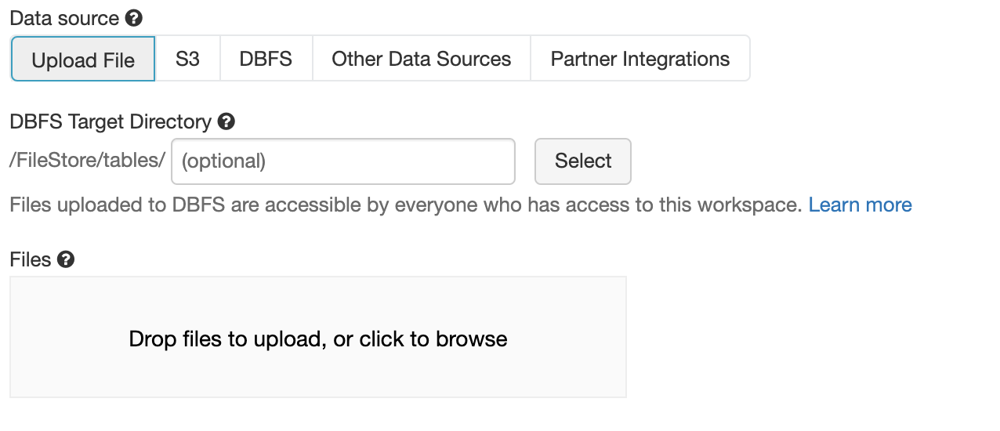
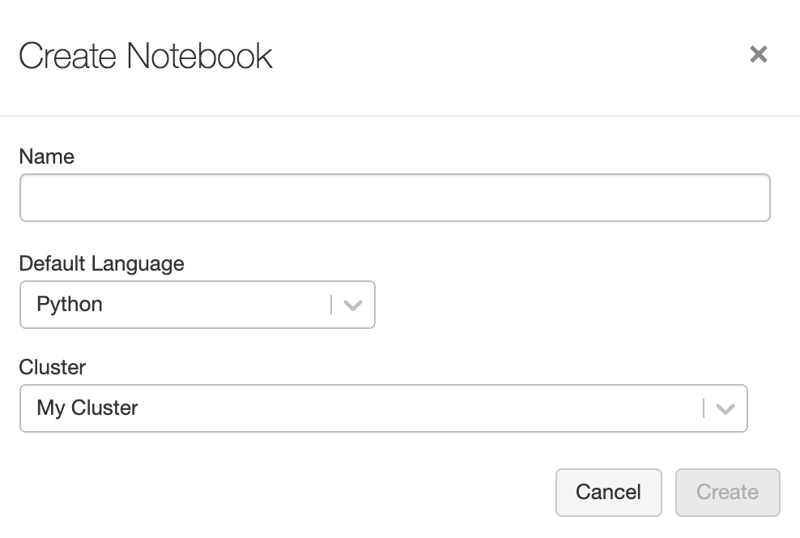

# Evaluación Final

- El trabajo es de caracter grupal (3 a 4 personas).
- Se deberá utilizar la plataforma **Databricks** vista en el curso.

## Instrucciones Generales

- Seleccionar y descargar del sitio web [Kagle.com](http://kaggle.com) un dataset sobre el cual el grupo desea realizar un análisis de datos. Se acepta que el grupo proponga otros datos pero estos deben cumplir con el criterio que el profesor entregue.
- El tamaño mínimo de los datos deberá ser de **1GB**.
- Se deberá cargar los datos en formato texto en el ambiente **DBFS** de Databricks.

    

- Crear un **Notebook** donde esté todo el código del trabajo. Este deberá ser compartido al profesor mediante enlace. Los lenguajes aceptados son Scala, Python o R.

    

## Requisitos mínimos

La estructura mínima del Notebook es:

- Sección de carga de los datos (se puede utilizar los códigos vistos en clase).
- Formateo y limipieza de los datos (si aplica).
- Lógicas de cálculos y generación de nuevas variables.
- Gráficos y explicaciones de los mismos.
- Guardar datos de manera persistente en tabla(s) Hive.

## Plazo y formato de entrega

El plazo de entrega es el día miércoles 03 de Noviembre antes de las 23:59 hrs. Por cada minuto de atraso se descontará 1 décima en la nota final.

El formato de entrega es:

- Asunto correo: Trabajo Big Data - Grupo NºXX al mail me@ccosming.com
- Adjunto de correo:
  - Archivo BigData_GrupoXX.pdf con el siguiente contenido (máximo 3 hojas).:
    - Descripción del problema y objetivos del análisis.
    - Descripción de los datos y enlace (si aplica).
    - Link del notebook de Databricks.
    - Conclusiones de los resultados obtenidos.

## Criterios de revisión.

- Cumplimiento de los requisitos y objetivos (50%).
- Calidad de los resultados obtenidos (25%).
- Complejidad del problema basado en el ranking (15%)
- Calidad del código (10%).
